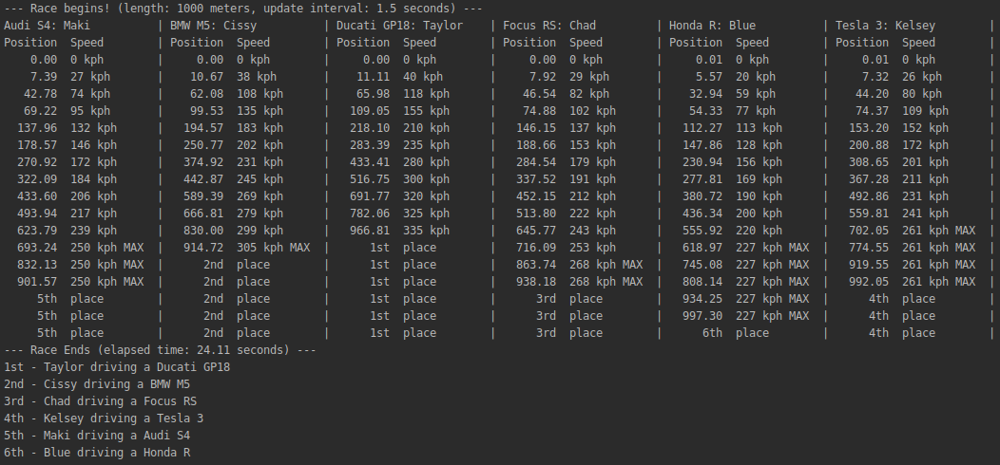

# CEN3024C-Assignment1
My example project developed for another Java class.

**Project criteria and specifications were as follows:**

Create a program that simulates a race between several vehicles.
- Design and implement an inheritance hierarchy that includes Vehicle as an abstract superclass and several subclasses.
- Include at least one interface that contains at least one method that implementing classes must implement.
- Include functionality to write the results of the race to a file; this will require Exception handling.
- Utilize threads to ensure that all race vehicles are moving in turn.

### Screenshot

